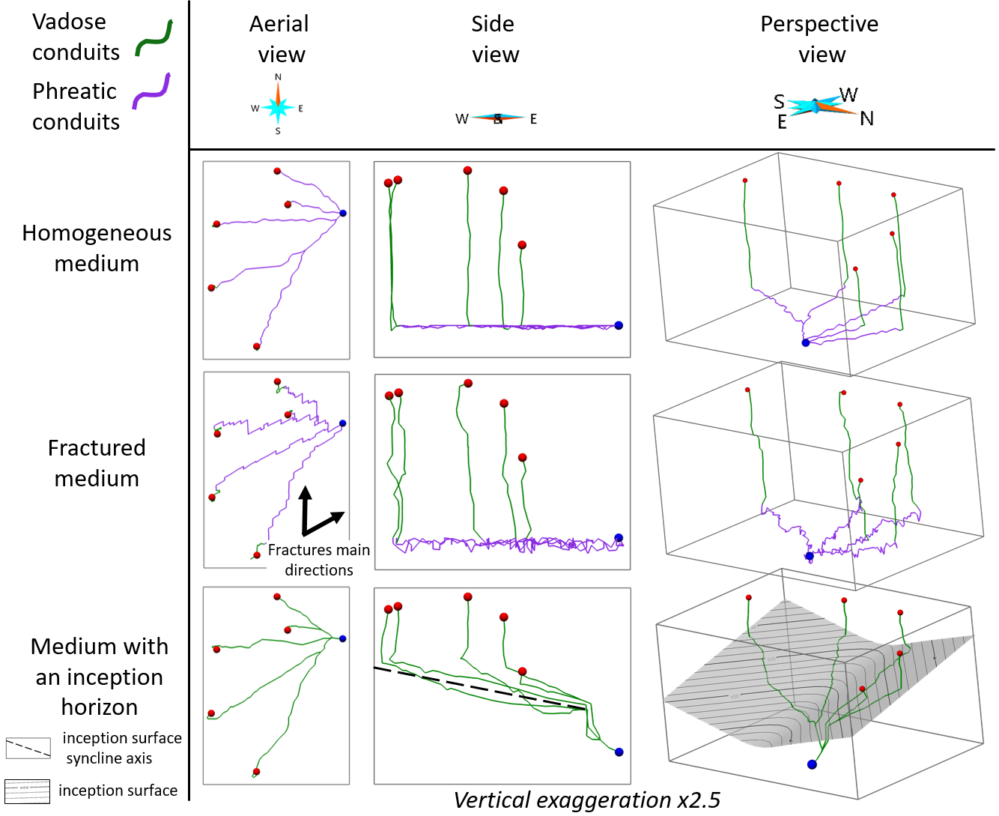

# KarstNSim_Public
Public version of KarstNSim, a C++ code for graph-based and geologically-driven simulation of 3D karst networks.

* Linked publication : INSERT DOI.

Its inputs and outputs are ASCII files and it can be run through a single command.
It adapts the Karst simulation code proposed by <b> Paris, A., Guérin, E., Peytavie, A., Collon, P., Galin, E., 2021. Synthesizing Geologically Coherent Cave Networks. Comput. Graph. Forum 40, 277–287. https://doi.org/10.1111/cgf.14420 which is available on Github at : https://github.com/aparis69/Karst-Synthesis. </b>
This implementation includes modifications as compared to this initial independant version, in order to better suit geological data and information. 

The first version of KarstNSim was done in the frame of <b> Benoit Thebault </b> master's thesis, supervised by Pauline Collon. It was presented in the 2022 RINGMeeting in: <b> Thebault, B., Collon, P., Antoine, C., Paris, A., Galin, E., 2022. Karstic network simulation with γ -graphs, in: 2022 RING Meeting. </b>
Since 2022 summer, KarstNSim is developed in the frame of <b> Augustin Gouy</b> PhD thesis, supervised by Pauline Collon and Vincent Bailly-Comte.
This public version corresponds to the version of KarstNSim used to generate results of the publication proposed by <b> Gouy A., Collon P., Bailly-Comte V., Galin E., Antoine C., Thebault B., Landrein P., 2024. KarstNSim: a graph-based method for 3D geologically-driven
simulation of karst networks. [insert DOI here] </b>

It is recommended to read the methodology presented in the article to better apprehend the code.

If you use this code, please cite : Gouy et al., 2024, Journal of Hydrology.

## Requirements

* [CMake](https://cmake.org/download/) 3.8 to 3.28 (select the Windows x64 Installer). During installation, check the option "add CMake to the system PATH".
* [Visual Studio 2017](https://my.visualstudio.com/Downloads?q=visual%20studio%202017&wt.mc_id=o~msft~vscom~older-downloads) or newer (for Windows).
* C++14 or newer (can be installed from Visual Studio).
* (Optional) [Doxygen 1.9.6](https://www.doxygen.nl/download.html) or newer for generating documentation.

## Compatibility

KarstNSim is designed to operate on Windows 10. While it hasn't been directly tested on Linux, there is an indication of compatibility based on a successful CMake test build.

## Installation

* Download the archive and unzip it somewhere (avoid spaces and special characters in the path).
* Go to the KarstNSim folder and run the batch file "build.bat", which will create a build folder and run CMake to generate build files and build the project (including compilation).
* An executable should have been generated in build/release/karstnsim.exe. To run the code, you can either double-click on karstnsim.exe, or open a command prompt anywhere and type :

```
cd path/to/your/executable
karstnsim.exe ../../../Input_files/instructions.txt
```

The instruction file is in the Input_files directory in the root of the archive. *Make sure to use "/" or "\\\\" but never "\\" for the paths.*

Outputs are stored in the outputs directory.

## Generate documentation files

A doxyfile is present in the archive. To automatically generate the documentation, type `doxygen path/to/YourDoxyfile` in a command prompt, or simply `doxygen doxyfile` if already in the root folder.

## Testing

We provide here a synthetic dataset and instruction file in the correct format used for KarstNSim, which corresponds to inputs used to generate examples similar to those of figure 12 in **[insert DOI]** (see figure below). By default the generated example is the homogeneous medium one. You can find those data in the Input_files folder.




If you want to make modifications to the input parameters, open the instructions.txt file and change options as needed.

It is advised to use a 3D viewer software to visualize complex inputs and outputs (the viewer is not provided in the archive).

<b>For any information </b>, please contact : 
* Augustin Gouy : augustin.gouy@univ-lorraine.fr
* Pauline Collon : pauline.collon@univ-lorraine.fr 
* Christophe Antoine : christophe.antoine@univ-lorraine.fr